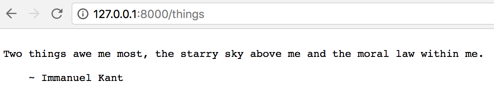

Title: Xây dựng API đơn giản với Python và Falcon - Phần 1  
Category: python  
Tags: python, gcp, falcon, api, deploy  
Author: kube.its.me  


Xây dựng API bằng Python là việc rất đơn giản. Trong 4 bài hướng dẫn, mình sẽ giúp bạn tạo một API đơn giản bằng Python với [Falcon framework](http://falcon.readthedocs.io/en/stable/) để khoe với cả trái đất này.

## Chuẩn bị:
1. Tài khoản github hoặc gitlab, bitbucket...  
2. Cài trên máy:
    - git
    - python 3 
    - virtualenv

## Khởi tạo ứng dụng
Đầu tiên, tạo một `repository` rỗng trên github, gitlab...bất cứ đâu cũng được và clone `repository` về máy bạn. Ví dụ tên `repository` là `example-api`.  
Trong thư mục vừa clone về, tạo các file sau:
- app.py: file chứa code
- requirements.txt: quản lý lib (thư viện) python 

Cấu trúc của ứng dụng sẽ như sau
```
example-api
├── app.py
└── requirements.txt
```
Mở file `app.py` và thêm vào đoạn code sau:
```python
# Let's get this party started!
import falcon


# Falcon follows the REST architectural style, meaning (among
# other things) that you think in terms of resources and state
# transitions, which map to HTTP verbs.
class ThingsResource(object):
    def on_get(self, req, resp):
        """Handles GET requests"""
        resp.status = falcon.HTTP_200  # This is the default status
        resp.body = ('\nTwo things awe me most, the starry sky '
                     'above me and the moral law within me.\n'
                     '\n'
                     '    ~ Immanuel Kant\n\n')

# falcon.API instances are callable WSGI apps
api = falcon.API()

# Resources are represented by long-lived class instances
things = ThingsResource()

# things will handle all requests to the '/things' URL path
api.add_route('/things', things)
```
Trong file `requirements.txt` bạn thêm vào các packages sau
```
mysqlclient
falcon
gunicorn
```

## Tạo và cài đặt môi trường ảo (Virtual Environment)
`Virtual Environment` dịch nôm na là môi trường ảo. Cũng giống như máy ảo (`Virtual Machine`), `Virtual Environment` thiết lập một môi trường ảo, cho phép bạn nghịch ngợm lung tung với các packages của Python mà không làm ảnh hưởng đến những packages đã được cài đặt sẵn trên Python.  
Lúc này bạn đang trong thư mục `example-api`, di chuyển ra khỏi thư mục `example-api` 
```
cd ..
```
Tạo môi trường ảo
```
python3 -m venv falcon-env
```
Sau khi tạo xong môi trường ảo, cấu trúc của ứng dụng sẽ như sau
```
example-api
├── app.py
└── requirements.txt
falcon-env
```
Kích hoạt môi trường ảo
```
source falcon-env/bin/activate
```
Di chuyển vào lại thư mục `example-api` và cài đặt các packages cần thiết
```
cd example-api/
pip install -r requirements.txt
```
**Trên ubuntu có thể không install được package `mysqlclient` thì bạn chạy lệnh này trước.
```
sudo apt-get update && sudo apt-get install libmysqlclient-dev
```
Sau khi cài đặt xong chạy lại lệnh
```
pip install -r requirements.txt
```

## Chạy thử ứng dụng
```
gunicorn app:api
```
```
[2018-05-04 23:22:02 +0700] [4418] [INFO] Starting gunicorn 19.8.1
[2018-05-04 23:22:02 +0700] [4418] [INFO] Listening at: http://127.0.0.1:8000 (4418)
[2018-05-04 23:22:02 +0700] [4418] [INFO] Using worker: sync
[2018-05-04 23:22:02 +0700] [4421] [INFO] Booting worker with pid: 4421
```
Truy cập vào đường dẫn trên [http://127.0.0.1:8000/things](http://127.0.0.1:8000/things)

**Bạn có thắc mắc vì sao phải thêm `/things` vào không? Vì trong file `app.py` có dòng:
```python
api.add_route('/things', things)
```
Hiểu đơn giản là `route` có nhiệm vụ định hướng request (nôm na là URL) của mình tới `resource` (ThingsResource) đã được định nghĩa sẵn.

Vậy là ứng dụng đã chạy, trong phần tiếp theo chúng ta sẽ kết nối ứng dụng với database để cho nó thêm phần phức tạp.
