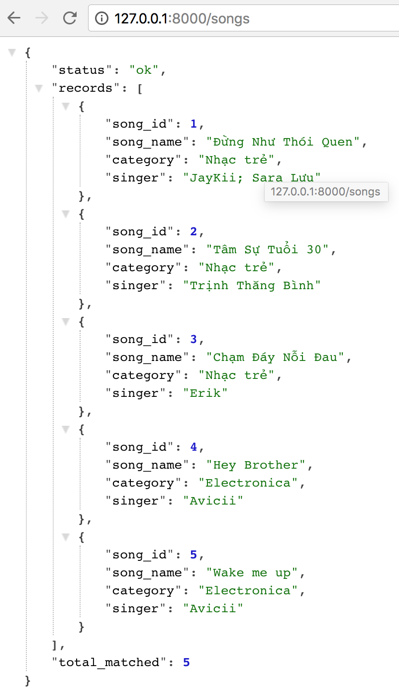

Title: Xây dựng API đơn giản với Python và Falcon - Phần 2  
Category: python  
Tags: python, gcp, falcon, api, deploy  
Author: kube.its.me  


Trong phần này, chúng ta sẽ tạo database và thêm resource vào cho ứng dụng.
## Chuẩn bị
+ Cài đặt `mysql` trên máy
+ Kiến thức cơ bản về database

## Tạo database
Trong phần trước, chúng ta đã xây dựng thành công một API đơn giản. Việc tiếp theo cần làm là tạo cho nó một database để lưu trữ dữ liệu.
```
mysql -u root -p
Enter password: 
```
**password mặc định mình hay để trống nên mình `Enter` luôn, sau khi đăng nhập vào mysql nó sẽ như này

Kiểm tra có bao nhiêu databases
```sql
mysql> show databases;
+----------------------+
| Database             |
+----------------------+
| information_schema   |
| mysql                |
| performance_schema   |
| sys                  |
+----------------------+
4 rows in set (0.00 sec)
```
Tiến hành tạo database
```sql
mysql> create database example_api;
Query OK, 1 row affected (0.01 sec)
```
Kiểm tra lại phát nào
```sql
mysql> show databases;
+----------------------+
| Database             |
+----------------------+
| information_schema   |
| example_api          |
| mysql                |
| performance_schema   |
| sys                  |
+----------------------+
5 rows in set (0.00 sec)
```
Đã có database `example_api`, muốn lưu trữ được dữ liệu thì cần phải tạo thêm table cho nó
```sql
mysql> use example_api;
Database changed
```
Xem trong database đã có tables nào chưa
```sql
mysql> show tables;
Empty set (0.00 sec)
```
Chưa có tables nào, tạo một table mới 
```sql
mysql> create table songs(
    -> id int,
    -> song_name varchar(255),
    -> category varchar(255),
    -> singer varchar(255)
    -> );
Query OK, 0 rows affected (0.03 sec)
```
Đã tạo thành công table tên là `songs`, kiểm tra lại lần nữa
```sql
mysql> show tables;
+-----------------------+
| Tables_in_example_api |
+-----------------------+
| songs                 |
+-----------------------+
1 row in set (0.00 sec)
```
Giờ thêm giữ liệu vào cho nó, trước khi thêm nên kiểm tra xem đã có dữ liệu chưa
```sql
mysql> select * from songs;
Empty set (0.00 sec)
```
Chưa có rồi, thêm dữ liệu vào
```sql
mysql> insert into songs (id, song_name, category, singer) 
    -> values (1, 'Đừng Như Thói Quen', 'Nhạc trẻ', 'JayKii; Sara Lưu'),
    -> (2, 'Tâm Sự Tuổi 30', 'Nhạc trẻ', 'Trịnh Thăng Bình'),
    -> (3, 'Chạm Đáy Nỗi Đau', 'Nhạc trẻ', 'Erik'),
    -> (4, 'Hey Brother', 'Electronica', 'Avicii'),
    -> (5, 'Wake me up', 'Electronica', 'Avicii');
Query OK, 5 rows affected (0.00 sec)
Records: 5  Duplicates: 0  Warnings: 0
```
Thêm dữ liệu thành công, kiểm tra lại phát nữa
```sql
mysql> select * from songs;
+--------+-------------------------+--------------+----------------------+
| id | song_name                | category     | singer               |
+--------+-------------------------+--------------+----------------------+
|      1 | Đừng Như Thói Quen      | Nhạc trẻ     | JayKii; Sara Lưu     |
|      2 | Tâm Sự Tuổi 30          | Nhạc trẻ     | Trịnh Thăng Bình     |
|      3 | Chạm Đáy Nỗi Đau        | Nhạc trẻ     | Erik                 |
|      4 | Hey Brother             | Electronica  | Avicii               |
|      5 | Wake me up              | Electronica  | Avicii               |
+--------+-------------------------+--------------+----------------------+
5 rows in set (0.00 sec)
```
Dữ liệu cũng đã có, sử dụng `\q` để thoát ra khỏi `mysql`
```
mysql> \q
Bye
```
## Kết nối database và thêm resource
Mở lại file `app.py` và thay thế code cũ bằng code ở dưới
```python
# Let's get this party started!
import falcon
import json
import MySQLdb


class SongsResource(object):
    def on_get(self, req, resp):
        # connect to mysql
        db = MySQLdb.connect(host='127.0.0.1',
                             user='root',
                             passwd='',
                             db='example_api',
                             use_unicode=True,
                             charset="utf8")
        c = db.cursor()
        # get data from table songs
        c.execute('select * from songs')
        songs = c.fetchall()
        # close connect
        db.close()
        records = []
        for song in songs:
            records.append({
                'id': song[0],
                'song_name': song[1],
                'category': song[2],
                'singer': song[3],
            })
        body = {
            'status': 'ok',
            'records': records,
            'total_matched': len(songs)
        }
        resp.status = falcon.HTTP_200
        resp.body = (json.dumps(body))


# Falcon follows the REST architectural style, meaning (among
# other things) that you think in terms of resources and state
# transitions, which map to HTTP verbs.
class ThingsResource(object):
    def on_get(self, req, resp):
        """Handles GET requests"""
        resp.status = falcon.HTTP_200  # This is the default status
        resp.body = ('\nTwo things awe me most, the starry sky '
                     'above me and the moral law within me.\n'
                     '\n'
                     '    ~ Immanuel Kant\n\n')

# falcon.API instances are callable WSGI apps
api = falcon.API()

# Resources are represented by long-lived class instances
things = ThingsResource()
songs = SongsResource()

# things will handle all requests to the '/things' URL path
api.add_route('/things', things)
api.add_route('/songs', songs)
```
Tắt ứng dụng đang chạy bằng cách `Control + C` (mình xài OSX), rồi chạy lại ứng dụng
```
gunicorn app:api
```
Truy cập vào đường dẫn [http://127.0.0.1:8000/songs](http://127.0.0.1:8000/songs)

Mọi thứ đã chạy ổn, giờ dùng `git` để push lên thôi. Nếu không muốn tạo lại database nữa thì chạy lệnh này để xuất dữ liệu ra:
```
mysqldump -u root -p example_api > example_api.sql
Enter password: 
```
Sau khi xuất cấu trúc thư mục sẽ như sau
```
example-api
├── app.py
├── requirements.txt
└── example_api.sql
falcon-env
```
Xong và giờ mình đã có database để có thể mang đi khắp nơi, do đây là ví dụ nên để file `example_api.sql` trong `repository` rồi push lên luôn (trên thực tế chẳng ai làm vậy cả vì vấn đề bảo mật).
Trong phần tiếp theo, chúng ta sẽ cùng nhau đem ứng dụng ra thế giới với Google Cloud.
