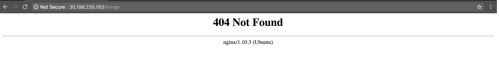
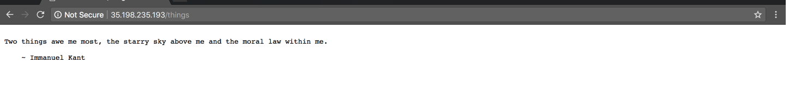

Title: Xây dựng REST API đơn giản với Python và Falcon - Phần 3  
Category: python  
Tags: python, gcp, falcon, api, deploy  
Author: kube.its.me  


Đây là phần hấp dẫn nhất vì nó sẽ giúp mang ứng dụng từ máy của bạn ra thế giới. Trong phần này mình sử dụng `Compute Engine` (hiểu nôm na là VPS Cloud - một dịch vụ của Google Cloud) để có thể quản lý database của mình hoặc các ứng dụng khác nếu mình muốn.   
Mình sẽ không hướng dẫn tạo tài khoản và `Enable Billing`, vì đã có rất nhiều bài hướng dẫn rồi hoặc bạn có thể coi từ trang [hỗ trợ](https://support.google.com/cloud/answer/6158867?hl=en) của Google.  
Hoặc có thể coi hướng dẫn nhanh về cách tạo và sử dụng `Compute Engine` từ Google bằng hình ảnh ở [đây](https://cloud.google.com/compute/docs/quickstart-linux).  
Dưới đây, mình sẽ hướng dẫn tạo và sử dụng `Compute Engine` bằng bộ Google Cloud SDK (`gcloud`).
## Chuẩn bị:
+ Tài khoản Google Cloud (đã Enable Billing)
+ Kiến thức cơ bản về Ubuntu

## Tải và cài đặt gcloud
Tải bộ [Google Cloud SDK](https://cloud.google.com/sdk/downloads) về và giải nén ra. Bật terminal lên và chạy lệnh
```
./google-cloud-sdk/install.sh
```
Tắt và mở lại terminal. Tiếp theo cấu hình tài khoản cho `gcloud`
```
gcloud init
```
Màn hình sẽ hiển thị chào mừng...
```
Welcome! This command will take you through the configuration of gcloud.

Your current configuration has been set to: [default]

You can skip diagnostics next time by using the following flag:
  gcloud init --skip-diagnostics

Network diagnostic detects and fixes local network connection issues.
Checking network connection...done.                                                                                           
Reachability Check passed.
Network diagnostic (1/1 checks) passed.

You must log in to continue. Would you like to log in (Y/n)?  
```
Nó bảo mình phải đăng nhập để tiếp tục, nhấn phím `Y` và `Enter`.  
Sau khi nhấn `Enter`, 1 tab của trình duyệt sẽ mở lên và yêu cầu chọn tài khoản (nếu có nhiều tài khoản đã đăng nhập).

Sau khi chọn tài khoản thì nhấn nút `CHO PHÉP` để cấp quyền cho `gcloud`.

Bạn sẽ được chuyển tới một trang với nội dung là đã xác thực thành công.

Quay lại terminal bạn sẽ thấy
```
Your browser has been opened to visit:

    https://accounts.google.com/o/oauth2/auth?redirect_uri=http%3A%2F%2Flocalhost%3A8085%2F&prompt=select_account&response_type=code&client_id=*********.apps.googleusercontent.com&scope=https%3A%2F%2Fwww.googleapis.com%2Fauth%2Fuserinfo.email+https%3A%2F%2Fwww.googleapis.com%2Fauth%2Fcloud-platform+https%3A%2F%2Fwww.googleapis.com%2Fauth%2Fappengine.admin+https%3A%2F%2Fwww.googleapis.com%2Fauth%2Fcompute+https%3A%2F%2Fwww.googleapis.com%2Fauth%2Faccounts.reauth&access_type=offline


You are logged in as: [*********@gmail.com].

This account has no projects.

Would you like to create one? (Y/n)?
```
Tiếp theo mình phải tạo một `project` để có thể sử dụng được `Compute Engine`. Nhấn `Y` và `Enter`
```
Enter a Project ID. Note that a Project ID CANNOT be changed later.
Project IDs must be 6-30 characters (lowercase ASCII, digits, or
hyphens) in length and start with a lowercase letter.
```
Đại khái là nó kêu bạn đặt tên cho `project` (chấp nhận ký tự ASCII thường, số và dấu gạch ngang)...trong bài này mình đặt tên cho `project` là `project-songs`. Sau khi đặt tên xong nhấn `Enter`
```
Your current project has been set to: [project-songs].

Not setting default zone/region (this feature makes it easier to use
[gcloud compute] by setting an appropriate default value for the
--zone and --region flag).
See https://cloud.google.com/compute/docs/gcloud-compute section on how to set
default compute region and zone manually. If you would like [gcloud init] to be
able to do this for you the next time you run it, make sure the
Compute Engine API is enabled for your project on the
https://console.developers.google.com/apis page.

Your Google Cloud SDK is configured and ready to use!

* Commands that require authentication will use *********@gmail.com by default
* Commands will reference project `project-songs` by default
Run `gcloud help config` to learn how to change individual settings

This gcloud configuration is called [default]. You can create additional configurations if you work with multiple accounts and/or projects.
Run `gcloud topic configurations` to learn more.

Some things to try next:

* Run `gcloud --help` to see the Cloud Platform services you can interact with. And run `gcloud help COMMAND` to get help on any gcloud command.
* Run `gcloud topic -h` to learn about advanced features of the SDK like arg files and output formatting
```
Đã tạo `project` thành công, để xem danh sách các `projects`
```
gcloud projects list
```
```
PROJECT_ID     NAME           PROJECT_NUMBER
project-songs  project-songs  579008193409
```
Tiếp theo mình sẽ cần tạo 1 `instance` (Compute Engine có thể tạo được nhiều instance), trước tiên phải kiểm tra xem có instances nào chưa
```
gcloud compute instances list
```
Và một thông báo lỗi sẽ xuất hiện
```
ERROR: (gcloud.compute.instances.list) Some requests did not succeed:
 - Project 579008193409 is not found and cannot be used for API calls. If it is recently created, enable Compute Engine API by visiting https://console.developers.google.com/apis/api/compute.googleapis.com/overview?project=579008193409 then retry. If you enabled this API recently, wait a few minutes for the action to propagate to our systems and retry.
```
Bạn copy link ở trên và paste vào trình duyệt web, nó sẽ dẫn bạn đến trang để `Enable Compute Engine API`

Nhấn vào nút `ENABLE` một popup hiện ra yêu cầu bạn phải `Enable Billing`

Tiếp tục nhấn vào `ENABLE BILLING` một popup khác lại hiện ra yêu cầu bạn cài đặt tài khoản thanh toán cho `project` của mình

Và nhấn vào `SET ACCOUNT`, đợi một tí nó sẽ chuyển bạn đến 1 trang khác giống như vậy

Quay lại terminal và kiểm tra xem `Compute Engine API` đã hoạt động chưa
```
gcloud compute instances list
```
```
Listed 0 items.
```
Mọi thứ đã hoạt động tốt tiến hành tạo `instance`
```
gcloud compute instances create [INSTANCE_NAME]
    --image-family [IMAGE_FAMILY]
    --image-project [IMAGE_PROJECT]
    --zone [ZONE]
    --tags http-server,https-server
```
Với:
  - [INSTANCE_NAME] tên `instance`
  - [IMAGE_FAMILY] và [IMAGE_PROJECT] nôm na là hệ điều hành để chạy trên `instance`, coi thêm ở [đây](https://cloud.google.com/compute/docs/images#os-compute-support)
  - [ZONE] nơi đặt `instance`
  - --tags http-server,https-server: cho phép truy cập bằng HTTP và HTTPS
```
gcloud compute instances create example-api --image-family ubuntu-1604-lts --image-project ubuntu-os-cloud --zone asia-southeast1-c --tags http-server,https-server
```
```
Created [https://www.googleapis.com/compute/v1/projects/project-songs/zones/asia-southeast1-c/instances/example-api].
NAME         ZONE               MACHINE_TYPE   PREEMPTIBLE  INTERNAL_IP  EXTERNAL_IP     STATUS
example-api  asia-southeast1-c  n1-standard-1               10.148.0.2   35.198.235.193  RUNNING
```
Đã tạo `intance` thành công, kiểm tra lại lần nữa cho chắc
```
gcloud compute instances list
```
```
NAME         ZONE               MACHINE_TYPE   PREEMPTIBLE  INTERNAL_IP  EXTERNAL_IP     STATUS
example-api  asia-southeast1-c  n1-standard-1               10.148.0.2   35.198.235.193  RUNNING
```
`Instance` đã có và để truy cập vào `instance` bằng trình duyệt web thông qua giao thức HTTP mình cần phải cấu hình thêm một bước nữa, xem đã `port 80` đã mở chưa
```
gcloud compute firewall-rules list
```
```
NAME                    NETWORK  DIRECTION  PRIORITY  ALLOW                         DENY
default-allow-icmp      default  INGRESS    65534     icmp
default-allow-internal  default  INGRESS    65534     tcp:0-65535,udp:0-65535,icmp
default-allow-rdp       default  INGRESS    65534     tcp:3389
default-allow-ssh       default  INGRESS    65534     tcp:22

To show all fields of the firewall, please show in JSON format: --format=json
To show all fields in table format, please see the examples in --help.
```
Chưa có rồi, thêm vào thôi
```
gcloud compute firewall-rules create rule-allow-tcp-80 --source-ranges 0.0.0.0/0 --target-tags allow-tcp-80 --allow tcp:80
```
```
Creating firewall...-Created [https://www.googleapis.com/compute/v1/projects/project-songs/global/firewalls/rule-allow-tcp-80].
Creating firewall...done.                                                                                                     
NAME               NETWORK  DIRECTION  PRIORITY  ALLOW   DENY
rule-allow-tcp-80  default  INGRESS    1000      tcp:80
```
Đã tạo xong, thêm nó vào `instance` nào
```
gcloud compute instances add-tags example-api --tags allow-tcp-80
```

```
No zone specified. Using zone [asia-southeast1-c] for instance: [example-api].
Updated [https://www.googleapis.com/compute/v1/projects/project-songs/zones/asia-southeast1-c/instances/example-api].
```
## Đăng nhập và cài đặt các packages cần thiết
Đăng nhập vào `instance`
```
gcloud compute ssh [INSTANCE_NAME]
```
```
gcloud compute ssh example-api
```
```
WARNING: The public SSH key file for gcloud does not exist.
WARNING: The private SSH key file for gcloud does not exist.
WARNING: You do not have an SSH key for gcloud.
WARNING: SSH keygen will be executed to generate a key.
Generating public/private rsa key pair.
Enter passphrase (empty for no passphrase): 
```
Do lần đầu đăng nhập chưa có `SSH key` - SDK sẽ tự tạo ra một `key` cho mình. Nhấn `Enter`
```
Enter same passphrase again: 
```
Nhấn `Enter` lần nữa, rồi đợi một tí
```
Your identification has been saved in /Users/kube/.ssh/google_compute_engine.
Your public key has been saved in /Users/kube/.ssh/google_compute_engine.pub.
The key fingerprint is:
SHA256:VIc95umck9XFwT7qpEY14bQM2dGtTJiehPVYUy8rNFw kube@letri.local
The key's randomart image is:
+---[RSA 2048]----+
|          .==+E++|
|         .o=BO.+=|
|        .  =X**oo|
|       .   .=B+=.|
|        S  oo++ .|
|           .*+   |
|          . +.   |
|           o .   |
|          .      |
+----[SHA256]-----+
No zone specified. Using zone [asia-southeast1-c] for instance: [example-api].
Updating project ssh metadata...|Updated [https://www.googleapis.com/compute/v1/projects/project-songs].                      
Updating project ssh metadata...done.                                                                                         
Waiting for SSH key to propagate.
Warning: Permanently added 'compute.6186573008226470554' (ECDSA) to the list of known hosts.
Welcome to Ubuntu 16.04.4 LTS (GNU/Linux 4.13.0-1015-gcp x86_64)

 * Documentation:  https://help.ubuntu.com
 * Management:     https://landscape.canonical.com
 * Support:        https://ubuntu.com/advantage

  Get cloud support with Ubuntu Advantage Cloud Guest:
    http://www.ubuntu.com/business/services/cloud

0 packages can be updated.
0 updates are security updates.


_____________________________________________________________________
WARNING! Your environment specifies an invalid locale.
 The unknown environment variables are:
   LC_CTYPE=UTF-8 LC_ALL=
 This can affect your user experience significantly, including the
 ability to manage packages. You may install the locales by running:

   sudo apt-get install language-pack-UTF-8
     or
   sudo locale-gen UTF-8

To see all available language packs, run:
   apt-cache search "^language-pack-[a-z][a-z]$"
To disable this message for all users, run:
   sudo touch /var/lib/cloud/instance/locale-check.skip
_____________________________________________________________________
```
Ở trên nó `CẢNH BÁO` mình cài đặt ngôn ngữ chưa hợp lệ nên làm thêm bước nữa
```
export LC_ALL="en_US.UTF-8"
```
```
export LC_CTYPE="en_US.UTF-8"
```
```
sudo dpkg-reconfigure locales
```

Ở bước này chỉ cần nhấn `Enter`, `Enter` và `Enter` thôi
```
Generating locales (this might take a while)...
  en_US.UTF-8... done
Generation complete.
```
Di chuyển vào thư mục `/`
```
cd /
```
Cập nhật và cài đặt thêm các gói (package) cần thiết
```
sudo apt-get update
```
```
sudo apt-get -y install nginx git-core libmysqlclient-dev mysql-server python3-pip python3-venv
```
Khi đang chạy sẽ xuất hiện như hình dưới, bạn cứ gõ mật khẩu mong muốn vào và `Enter`

Sau khi nhấn `Enter`, sẽ xuất hiện thêm màn hình nhập lại mật khẩu - bạn cứ nhập mật khẩu lúc nãy và nhấn `Enter`


Sau khi đã cài đặt xong, kiểm tra xem đã có python 3 chưa
```
python3 -V
```
```
Python 3.5.2
```
Lúc này bạn đang đứng ở thư mục `/`, nên di chuyển vào thư mục `/opt` 
```
cd opt/
```
Tạo một thư mục tên là `www`
```
sudo mkdir www
```
Di chuyển vào thư mục `www` vừa tạo
```
cd wwww
```
Đã có python 3 tiến hành tạo môi trường ảo cho nó
```
python3 -m venv falcon-env
```
Phân quyền cho thư mục `falcon-env`
```
sudo chmod -R 755 falcon-env/
```
Kích hoạt môi trường ảo
```
source falcon-env/bin/activate
```
Nâng cấp `pip` lên phiên bản mới nhất
```
pip install --upgrade pip
```
Clone `repository` của bạn và di chuyển vào thư mục vừa clone về
```
cd `tên_repository`
```
Cài đặt cái packages của python
```
pip install -r requirements.txt
```
Tạo database cho ứng dụng
```sql
mysql -u root -p
```
```sql
mysql> create database example_api;
Query OK, 1 row affected (0.00 sec)
mysql> \q
Bye
```
Trong thư mục vừa clone về đã có database nên chỉ cần import vào
```
mysql -u root -p example_api < example_api.sql
```
Vào kiểm tra lại lần nữa cho chắc
```sql
mysql -u root -p
```
```sql
mysql> use example_api;
Reading table information for completion of table and column names
You can turn off this feature to get a quicker startup with -A
Database changed
mysql> select * from songs;
+--------+-------------------------+--------------+----------------------+
| id | song_name                | category     | singer               |
+--------+-------------------------+--------------+----------------------+
|      1 | Đừng Như Thói Quen      | Nhạc trẻ     | JayKii; Sara Lưu     |
|      2 | Tâm Sự Tuổi 30          | Nhạc trẻ     | Trịnh Thăng Bình     |
|      3 | Chạm Đáy Nỗi Đau        | Nhạc trẻ     | Erik                 |
|      4 | Hey Brother             | Electronica  | Avicii               |
|      5 | Wake me up              | Electronica  | Avicii               |
+--------+-------------------------+--------------+----------------------+
5 rows in set (0.01 sec)
mysql> \q
Bye
```
Mở file `app.py` sửa lại thông số
```
nano app.py
```
Chỉ cần thay đổi thông số của `passwd` và `db`
```python
db = MySQLdb.connect(host='127.0.0.1',
                     user='root',
                     passwd='password của bạn',
                     db='example_api',
                     use_unicode=True,
                     charset="utf8")
```
Bấm `Control + X` sau đó `shift + Y` rồi `Enter` để lưu lại.
Chạy thử ứng dụng
```
gunicorn app:api
```
```
[2018-05-05 16:29:12 +0000] [19408] [INFO] Starting gunicorn 19.8.1
[2018-05-05 16:29:12 +0000] [19408] [INFO] Listening at: http://127.0.0.1:8000 (19408)
[2018-05-05 16:29:12 +0000] [19408] [INFO] Using worker: sync
[2018-05-05 16:29:12 +0000] [19411] [INFO] Booting worker with pid: 19411
```
Vậy là không có lỗi gì xảy ra, mở thêm một tab của terminal (OSX: Command + T)
```
gcloud compute instances list
```
```
NAME         ZONE               MACHINE_TYPE   PREEMPTIBLE  INTERNAL_IP  EXTERNAL_IP     STATUS
example-api  asia-southeast1-c  n1-standard-1               10.148.0.2   35.198.235.193  RUNNING
```
Mở trình duyệt web lên và nhập `EXTERNAL_IP` ở trên vào

`Compute Engine` đã chạy, thử vào ứng dụng của mình xem
```
35.198.235.193/things
```

```
35.198.235.193/songs
```

Rõ ràng là ứng dụng đã chạy rồi nhưng sao lại báo không tìm thấy? Không sao đâu do mình chưa config đó mà một vài bước nữa sẽ xong thôi.  
Tắt ứng dụng đang chạy (`Control + C`).  
## Cấu hình nginx
Giờ mình bắt đầu vào config `nginx`. Mình không phải dân chuyên về `network` nên mình hiểu nôm na `nginx` là một web server.  
Let's do it. Đầu tiên tạo mới một file bạn có thể thay thế `example-api` nếu muốn.
```
sudo nano /etc/nginx/sites-available/example-api
```
Chép cái đống này vào và chỗ `server_name` thay thế bằng `External IP`
```dns
server {
    listen       80;
    server_name  35.198.235.193;
    location / {
        proxy_pass http://127.0.0.1:8000;
    }
}
```
`Control + X` và `Shift Y` rồi nhấn `Enter` để lưu lại.  
Sau đó chạy thêm lệnh này, bạn muốn hiểu thêm về lệnh của linux thì vào [đây](https://explainshell.com/) 
```
sudo ln -s /etc/nginx/sites-available/example-api /etc/nginx/sites-enabled/
```
Kiểm tra xem file config `nginx` mình vừa tạo có lỗi cú pháp nào không
```
sudo nginx -t
```
Nếu không có lỗi thì sẽ hiển thị như này
```
nginx: the configuration file /etc/nginx/nginx.conf syntax is ok
nginx: configuration file /etc/nginx/nginx.conf test is successful
```
Khởi động lại `nginx`
```
sudo systemctl restart nginx
```
Mọi thứ đã xong, chạy lại ứng dụng
```
gunicorn app:api
```
Kiểm tra xem nào, gõ `External IP` lên trình duyệt web

Khi truy cập vào `External IP` sẽ có thông báo không tìm thấy page. Để giải quyết vấn đề này thì bạn có thể config lại file `nginx` hoặc có thể dùng hàm `handle_404` trong `Falcon`. 
Vào tiếp thằng `/things` xem nào
```
35.198.235.193/things
```

Ổn rồi, vào thằng `/songs` xem
```
35.198.235.193/songs
```

Đến đây có thể được coi là xong nhưng chưa hoàn chỉnh. Bạn đọc tiếp phần sau để biết vì sao ứng dụng của mình chưa hoàn chỉnh.
