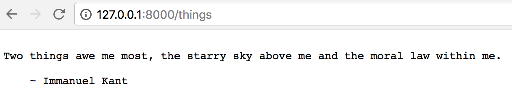

Title: Cùng tạo và deploy ứng dụng API đơn giản lên Google Cloud Platform
Category: python
Tags: python
Author: kubeitsme

Trong bài này, mình sử dụng Falcon framework để xây dựng API. Bạn có thể xem thêm tại [đây](http://falcon.readthedocs.io/en/stable/) hoặc bạn có thể sử dụng Flask cách làm cũng tương tự.
# Chuẩn bị:
1. Tài khoản của [Google Cloud](https://cloud.google.com/)

Đừng lo Google cho mình $300 miễn phí và có thể sử dụng được trong 12 tháng. Nhớ là phải Enable Billing và trong thẻ Visa hoặc Credit Card phải còn tối thiểu 100k (vì khi đăng ký sẽ phải cần $1) nhé.

2. Tài khoản git

3. Cài trên máy:
  - git
  - python 3 
  - mysql
  - virtualenv
# Tạo ứng dụng API đơn giản
Đầu tiên, tạo một `repositories` rỗng trên github, gitlab...bất cứ đâu cũng được và clone `repositories` về máy bạn.
Trong thư mục vừa clone về, bạn tạo các file sau nhé:
- app.py: ứng dụng API
- requirements.txt: quản lý lib python

Tạo một file `app.py` có nội dung như sau:
```
# Let's get this party started!
import falcon


# Falcon follows the REST architectural style, meaning (among
# other things) that you think in terms of resources and state
# transitions, which map to HTTP verbs.
class ThingsResource(object):
    def on_get(self, req, resp):
        """Handles GET requests"""
        resp.status = falcon.HTTP_200  # This is the default status
        resp.body = ('\nTwo things awe me most, the starry sky '
                     'above me and the moral law within me.\n'
                     '\n'
                     '    ~ Immanuel Kant\n\n')

# falcon.API instances are callable WSGI apps
api = falcon.API()

# Resources are represented by long-lived class instances
things = ThingsResource()

# things will handle all requests to the '/things' URL path
api.add_route('/things', things)
```
Tạo một file `requirements.txt` để quản lý các gói
```
mysqlclient
falcon
gunicorn
```
Tiếp theo, chạy thử ứng dụng:
1. Tạo môi trường ảo và cài đặt các gói cần thiết
```
python3 -m venv falcon-env
source falcon-env/bin/activate
pip install -r requirements.txt
```
**Trên ubuntu có thể không install được lib `mysqlclient` thì bạn chạy lệnh này trước nhé
```
sudo apt-get update && sudo apt-get install libmysqlclient-dev
```
và chạy lại lệnh này (nhớ là phải trong virtualenv)
```
pip install -r requirements.txt
```
2. Chạy thử trên terminal
```
gunicorn app:api
```
3. Sau khi chạy lệnh trên terminal sẽ hiển thị như sau
```
[2018-05-04 23:22:02 +0700] [4418] [INFO] Starting gunicorn 19.8.1
[2018-05-04 23:22:02 +0700] [4418] [INFO] Listening at: http://127.0.0.1:8000 (4418)
[2018-05-04 23:22:02 +0700] [4418] [INFO] Using worker: sync
[2018-05-04 23:22:02 +0700] [4421] [INFO] Booting worker with pid: 4421
```
4. Truy cập vào đường dẫn trên
```
http://127.0.0.1:8000/things
```
à tại sao lại có `/things` vì trong file `app.py` có dòng
```
api.add_route('/things', things)
```
kết quả

# Deploy ứng dụng
Mình sử dụng dịch vụ Compute Engine (hay có thể gọi là VPS) nên nó sẽ hơi phức tạp so với việc sử dụng App Engine.
### WIP
https://www.digitalocean.com/community/tutorials/how-to-serve-flask-applications-with-gunicorn-and-nginx-on-ubuntu-16-04
http://falcon.readthedocs.io/en/stable/
https://viblo.asia/p/huong-dan-tao-ung-dung-web-python-don-gian-tren-google-app-engine-QpmleARnlrd

