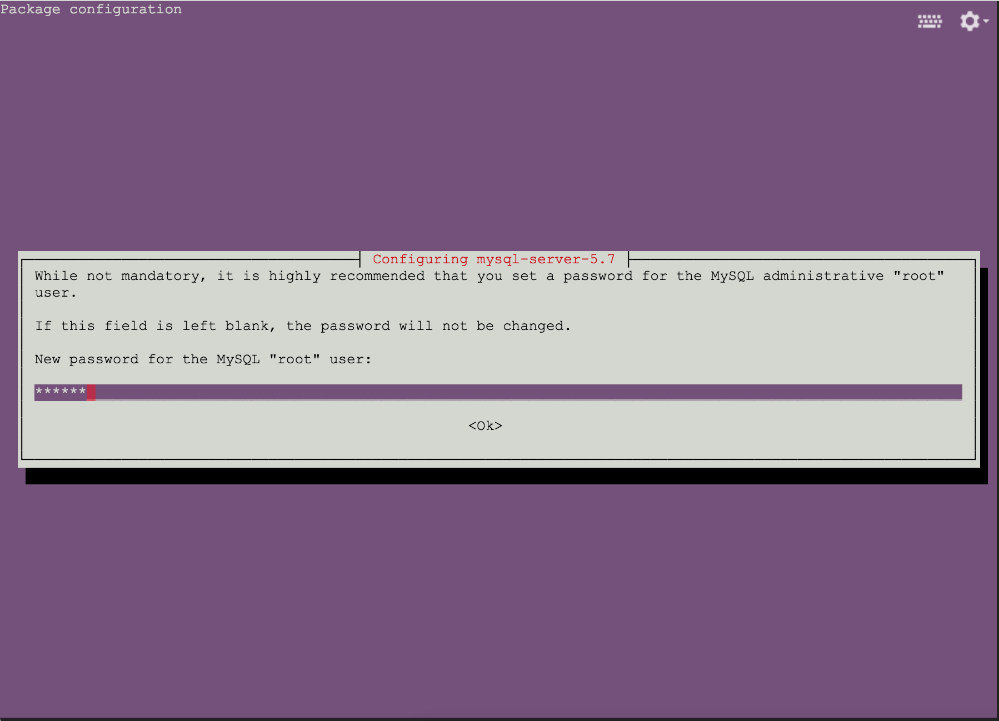
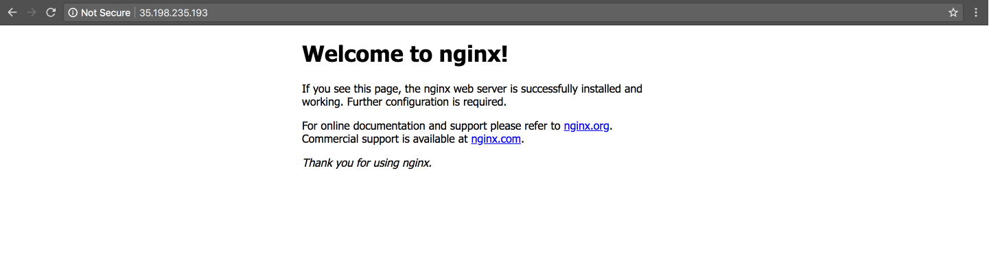

Title: Tạo và deploy ứng dụng API đơn giản lên Google Cloud Platform  
Category: python  
Tags: python, gcp, falcon, api, deploy  
Author: kubeitsme  

Trong bài này, mình sử dụng [Falcon framework](http://falcon.readthedocs.io/en/stable/) để xây dựng API hoặc bạn có thể sử dụng Flask cách làm cũng tương tự.
## Chuẩn bị:
1. Tài khoản của [Google Cloud](https://cloud.google.com/)  
Đừng lo Google cho mình $300 miễn phí và có thể sử dụng được trong 12 tháng. Nhớ là phải Enable Billing và trong thẻ Visa hoặc Credit Card phải còn tối thiểu 100.000 VNĐ (vì khi đăng ký sẽ phải cần $1).  
2. Tài khoản github, gitlab, bitbucket  
3. Cài trên máy:
    - git
    - python 3 
    - mysql
    - virtualenv

## Tạo ứng dụng API đơn giản
Đầu tiên, tạo một `repository` rỗng trên github, gitlab...bất cứ đâu cũng được và clone `repository` về máy bạn.
Trong thư mục vừa clone về, bạn tạo các file sau:
- app.py: file chứa code
- requirements.txt: quản lý lib python  

Mở file `app.py` vừa tạo và chép đoạn mã sau vào:
```python
# Let's get this party started!
import falcon


# Falcon follows the REST architectural style, meaning (among
# other things) that you think in terms of resources and state
# transitions, which map to HTTP verbs.
class ThingsResource(object):
    def on_get(self, req, resp):
        """Handles GET requests"""
        resp.status = falcon.HTTP_200  # This is the default status
        resp.body = ('\nTwo things awe me most, the starry sky '
                     'above me and the moral law within me.\n'
                     '\n'
                     '    ~ Immanuel Kant\n\n')

# falcon.API instances are callable WSGI apps
api = falcon.API()

# Resources are represented by long-lived class instances
things = ThingsResource()

# things will handle all requests to the '/things' URL path
api.add_route('/things', things)
```
Tiếp tục mở file `requirements.txt` và chép đoạn text ở dưới vào
```
mysqlclient
falcon
gunicorn
```
Tiếp theo, chạy thử ứng dụng:
1. Tạo môi trường ảo và cài đặt các gói cần thiết
```
python3 -m venv falcon-env
source falcon-env/bin/activate
pip install -r requirements.txt
```
**Trên ubuntu có thể không install được lib `mysqlclient` thì bạn chạy lệnh này trước.
```
sudo apt-get update && sudo apt-get install libmysqlclient-dev
```
Nếu không may bạn bị thoát ra khỏi môi trường ảo, thì chạy lệnh sau để kích hoạt lại môi trường ảo. Vậy làm sao để biết mình có đang trong môi trường ảo hay không?
Bạn để ý vào dấu nhắc lệnh (command prompt), mình lấy ví dụ ở Ubuntu. Đây là khi chưa kích hoạt môi trường ảo
```
username@ubuntu:~$
```
Sau khi chạy lệnh
```
source falcon-env/bin/activate
```
Môi trường ảo đã kích hoạt thì dấu nhắc lệnh (command prompt) của bạn sẽ như sau
```
(falcon-env)username@ubuntu:~$
```
- `falcon-env` là tên môi trường ảo mình đã tạo ở trên.

Tiếp tục nào, chạy lại lệnh
```
pip install -r requirements.txt
```
2. Chạy thử trên terminal
```
gunicorn app:api
```
```
[2018-05-04 23:22:02 +0700] [4418] [INFO] Starting gunicorn 19.8.1
[2018-05-04 23:22:02 +0700] [4418] [INFO] Listening at: http://127.0.0.1:8000 (4418)
[2018-05-04 23:22:02 +0700] [4418] [INFO] Using worker: sync
[2018-05-04 23:22:02 +0700] [4421] [INFO] Booting worker with pid: 4421
```
3. Truy cập vào đường dẫn trên [http://127.0.0.1:8000/things](http://127.0.0.1:8000/things)

**Bạn có thắc mắc vì sau phải thêm `/things` vào không? Vì trong file `app.py` mình có dòng sau:
```
api.add_route('/things', things)
```
Chỉ cần hiểu đơn giản `route` có nhiệm vụ định hướng request (nôm na là URL) của mình tới một hành động (action) tự định nghĩa nào đó để xử lý.

Kết quả

Bây giờ chúng ta đã có một API đơn giản rồi, giờ làm cho nó phức tạp thêm xíu. Đầu tiên phải tạo database trước đã
```
mysql -u root -p
Enter password: 
```
**password mặc định mình hay để trống nên mình Enter luôn, sau khi đăng nhập vào mysql nó sẽ như này

kiểm tra coi đang có bao nhiêu databases
```
mysql> show databases;
+----------------------+
| Database             |
+----------------------+
| information_schema   |
| mysql                |
| performance_schema   |
| sys                  |
+----------------------+
4 rows in set (0.00 sec)
```
giờ mình tiến hành tạo database cho app của mình thôi
```
mysql> create database example_api;
Query OK, 1 row affected (0.01 sec)
```
Kiểm tra lại phát nào
```
mysql> show databases;
+----------------------+
| Database             |
+----------------------+
| information_schema   |
| example_api          |
| mysql                |
| performance_schema   |
| sys                  |
+----------------------+
5 rows in set (0.00 sec)
```
đã có database rồi thì phải có tạo thêm table để lưu dữ liệu thôi
```
mysql> use example_api;
Database changed
mysql> show tables;
Empty set (0.00 sec)
mysql> create table songs(
    -> id int,
    -> song_name varchar(255),
    -> category varchar(255),
    -> singer varchar(255)
    -> );
Query OK, 0 rows affected (0.03 sec)
mysql> show tables;
+-----------------------+
| Tables_in_example_api |
+-----------------------+
| songs                 |
+-----------------------+
1 row in set (0.00 sec)
```
Giờ chúng ta đã có table tên là `songs`, thêm giữ liệu vào cho nó thôi. Sau khi thêm dữ liệu xong,kiểm tra trong table `songs` đã có dữ liệu chưa đã
```
mysql> select * from songs;
Empty set (0.00 sec)
```
Chưa có rồi, tiến hành thêm dữ liệu vào thôi
```
mysql> insert into songs (id, song_name, category, singer) 
    -> values (1, 'Đừng Như Thói Quen', 'Nhạc trẻ', 'JayKii; Sara Lưu'),
    -> (2, 'Tâm Sự Tuổi 30', 'Nhạc trẻ', 'Trịnh Thăng Bình'),
    -> (3, 'Chạm Đáy Nỗi Đau', 'Nhạc trẻ', 'Erik'),
    -> (4, 'Hey Brother', 'Electronica', 'Avicii'),
    -> (5, 'Wake me up', 'Electronica', 'Avicii');
Query OK, 5 rows affected (0.00 sec)
Records: 5  Duplicates: 0  Warnings: 0
```
Xong rồi nè, kiểm tra lại phát nữa
```
mysql> select * from songs;
+--------+-------------------------+--------------+----------------------+
| id | song_name                | category     | singer               |
+--------+-------------------------+--------------+----------------------+
|      1 | Đừng Như Thói Quen      | Nhạc trẻ     | JayKii; Sara Lưu     |
|      2 | Tâm Sự Tuổi 30          | Nhạc trẻ     | Trịnh Thăng Bình     |
|      3 | Chạm Đáy Nỗi Đau        | Nhạc trẻ     | Erik                 |
|      4 | Hey Brother             | Electronica  | Avicii               |
|      5 | Wake me up              | Electronica  | Avicii               |
+--------+-------------------------+--------------+----------------------+
5 rows in set (0.00 sec)
```
Dữ liệu đã có rồi, thoát ra thôi
```
mysql> \q
Bye
```
Mở lại file `app.py` và chép code này vào
```python
# Let's get this party started!
import falcon
import json
import MySQLdb


class SongsResource(object):
    def on_get(self, req, resp):
        db = MySQLdb.connect(host='127.0.0.1',
                             user='root',
                             passwd='',
                             db='example_api',
                             use_unicode=True,
                             charset="utf8")
        c = db.cursor()
        c.execute('select * from songs')
        songs = c.fetchall()
        db.close()
        records = []
        for song in songs:
            records.append({
                'id': song[0],
                'song_name': song[1],
                'category': song[2],
                'singer': song[3],
            })
        body = {
            'status': 'ok',
            'records': records,
            'total_matched': len(songs)
        }
        resp.status = falcon.HTTP_200
        resp.body = (json.dumps(body))


# Falcon follows the REST architectural style, meaning (among
# other things) that you think in terms of resources and state
# transitions, which map to HTTP verbs.
class ThingsResource(object):
    def on_get(self, req, resp):
        """Handles GET requests"""
        resp.status = falcon.HTTP_200  # This is the default status
        resp.body = ('\nTwo things awe me most, the starry sky '
                     'above me and the moral law within me.\n'
                     '\n'
                     '    ~ Immanuel Kant\n\n')

# falcon.API instances are callable WSGI apps
api = falcon.API()

# Resources are represented by long-lived class instances
things = ThingsResource()
songs = SongsResource()

# things will handle all requests to the '/things' URL path
api.add_route('/things', things)
api.add_route('/songs', songs)
```
Tắt app đang chạy bằng cách `Control + C` (mình xài OSX), rồi chạy lại app như ở trên mình đã hướng dẫn. Truy cập vào đường dẫn:
```
http://127.0.0.1:8000/songs
```
và kết quả

Mọi thứ đã xong rồi, các bạn push lên git thôi nếu không muốn phải tạo lại table thì làm theo mình (nhớ là phải trong `repository` của git mà ta đã tạo lúc đầu nha)
```
mysqldump -u root -p example_api > example_api.sql
Enter password: 
```
Xong rồi giờ mình đã có database, do đây là ví dụ thôi nên push file `example_api.sql` lên git luôn (trên thực tế chẳng ai làm vậy đâu hí hí).
## Deploy ứng dụng
Và đây là phần hấp dẫn nhất, ở đây mình sử dụng Compute Engine (hay có thể gọi là Cloud VPS) để có thể quản lý database của mình hoặc các app khác nếu mình muốn.  
Ở đây mình không hướng dẫn các bạn tạo tài khoản và `Enable Billing`, bạn có thể google giúp mình vì đã có rất nhiều bài hướng dẫn rồi. Các bạn truy cập vào đường dẫn sau:
```
https://console.cloud.google.com/
```
Giao diện sẽ hiển thị như thế này

Ngay trên cùng bên tay trái kế bên `Google Cloud Platform` bạn click vào `Select a project`, một Pop-up sẽ xuất hiện

Click vào dấu `+` bên tay phải, bạn sẽ được chuyển qua một trang khác

Điền tên mà bạn muốn vào Project Name và click vào nút `CREATE`, lúc này bạn sẽ được quay lại trang ban đầu. Bạn kéo chuột xuống một chút sẽ thấy ở phần `Poppular solutions` có phần `Compute Engine` click vào phần đó đi

Bạn sẽ lại được chuyển tới một trang khác, click vào nút `GO TO COMPUTE ENGINIE` nha

Bạn tiếp tục được chuyển tới một trang khác nữa rồi, haha mệt chưa? Thôi tiếp tục nào, click vào cái nút `Create` xanh xanh đó

Lại được chuyển qua trang khác nữa rồi, ở phần này bạn chọn giống mình.

- `Name`: bạn điền vào gì cũng được
- `Zone`: tuỳ bạn chọn thôi, mình thích `asia-southeast1-c` nên mình chọn. Bạn đổi zone khác tiền mỗi tháng sẽ khác nhau
- `Machine type`: cứ để mặc định
- `Boot disk`: mặc định là `Debian` bạn bấm vào nút `Change` để chọn OS mình thích. Nhưng trong bài này mình sử dụng `Ubuntu` nên mình khuyên là nên đổi thành `Ubuntu 16.04 LTS` như hình

Phần không kém quan trọng là `Firewall` bạn nhớ check vào 2 ô này:
- Allow HTTP traffic
- Allow HTTPS traffic
Rồi nhấn nút `Create` thôi và xem thành quả thôi

Bạn nhớ để ý chỗ `External IP` nhé, quan trọng lắm đấy.
Bạn có thấy `SSH` chứ, click vào đó đi sẽ hiển thị như hình dưới

Bạn click vào dòng đầu tiên `Open in browser window` và một cửa sổ mới sẽ xuất hiện

Gần xong rồi, cố lên nào (mình biết bài này hơi dài). Bạn chạy những lệnh này giúp mình nhé
```
sudo apt-get update
sudo apt-get -y install nginx git-core libmysqlclient-dev mysql-server python3-pip python3-venv
```
Khi đang chạy sẽ có xuất hiện như hình dưới, bạn cứ gõ mật khẩu mong muốn vào và Enter

Sau khi nhấn Enter, sẽ xuất hiện thêm màn hình nhập lại mật khẩu - bạn cứ nhập mật khẩu lúc nãy và nhấn Enter nhé

Sau khi chạy xong, kiểm tra coi đã có python 3 chưa
```
python3 -V
Python 3.5.2
```
OK đã có python 3, tạo môi trường ảo cho nó thôi
```
python3 -m venv falcon-env
source falcon-env/bin/activate
```
OK lúc này mình đã trong môi trường ảo, bạn clone `repository` vừa tạo ở trên về nha, và di chuyển vào thư mục của `repository` vừa clone về
```
cd `tên_repository`
pip install -r requirements.txt
```
Các lib đã có, source đã có...giờ tới phần cũng không kém quan trọng là tạo database cho nó. Cũng giống phía trên mình đã hướng dẫn thôi à, nên mình đi nhanh xíu
```
mysql -u root -p
mysql> create database example_api;
Query OK, 1 row affected (0.00 sec)
mysql> \q
Bye
```
Trong thư mục vừa clone về đã có database sẵn (lúc nãy mình kêu push lên luôn ấy) nên mình chỉ cần import vào thôi
```
mysql -u root -p example_api < example_api.sql
```
Vào kiểm tra lại lần nữa cho chắc
```
mysql -u root -p
mysql> use example_api;
Reading table information for completion of table and column names
You can turn off this feature to get a quicker startup with -A
Database changed
mysql> select * from songs;
+--------+-------------------------+--------------+----------------------+
| id | song_name                | category     | singer               |
+--------+-------------------------+--------------+----------------------+
|      1 | Đừng Như Thói Quen      | Nhạc trẻ     | JayKii; Sara Lưu     |
|      2 | Tâm Sự Tuổi 30          | Nhạc trẻ     | Trịnh Thăng Bình     |
|      3 | Chạm Đáy Nỗi Đau        | Nhạc trẻ     | Erik                 |
|      4 | Hey Brother             | Electronica  | Avicii               |
|      5 | Wake me up              | Electronica  | Avicii               |
+--------+-------------------------+--------------+----------------------+
5 rows in set (0.01 sec)
mysql> \q
Bye
```
Mở file `app.py` để sửa lại config tí nào
```
nano app.py
```
Chỉ cần thay đổi thông số của `passwd` và `db` thôi nha
```
db = MySQLdb.connect(host='127.0.0.1',
                     user='root',
                     passwd='password của bạn',
                     db='example_api',
                     use_unicode=True,
                     charset="utf8")
```
Bấm `Control + X` sau đó `shift + Y` rồi `Enter` để lưu lại.
Chạy thử app của mình xem nào
```
gunicorn app:api
```
```
[2018-05-05 16:29:12 +0000] [19408] [INFO] Starting gunicorn 19.8.1
[2018-05-05 16:29:12 +0000] [19408] [INFO] Listening at: http://127.0.0.1:8000 (19408)
[2018-05-05 16:29:12 +0000] [19408] [INFO] Using worker: sync
[2018-05-05 16:29:12 +0000] [19411] [INFO] Booting worker with pid: 19411
```
OK không vấn đề gì rồi, nãy mình có nói nhớ lưu ý chỗ `External IP` bạn nhớ chứ. Bây giờ là lúc sử dụng nó đây, mở trình duyệt web của bạn lên và gõ vào `External IP`
```
35.197.138.174
```

Compute Engine của bạn đã chạy rồi, thử vào app của mình xem (nhớ thay bằng `External IP` của bạn nha)
```
35.197.138.174/things
```

```
35.197.138.174/songs
```

Ủa ủa là sao rõ ràng là app đã chạy rồi nhưng sao lại báo không tìm thấy? Hi, không sao đâu do mình chưa config đó mà một vài bước nữa sẽ xong thôi.  
Tắt app đang chạy đi bằng phím `Control + C`.  
Giờ mình bắt đầu vào config `nginx` thôi. À mình không phải dân chuyên về bên mạng nên mình hiểu nôm na `nginx` là một web server thế thôi hehe.  
Let's do it. Đầu tiên tạo mới một file bạn có thể thay thế `example-api` nếu muốn.
```
sudo nano /etc/nginx/sites-available/example-api
```
Chép cái đống này vào và chỗ `server_name` thay thế bằng `External IP` của bạn.
```
server {
    listen       80;
    server_name  35.197.138.174;
    location / {
        proxy_pass http://127.0.0.1:8000;
    }
}
```
Không nhớ cách save lại thì lên trên coi lại nhé.  
Sau đó chạy thêm lệnh này, bạn muốn hiểu thêm về lệnh của linux thì vào [đây](https://explainshell.com/) nhé 
```
sudo ln -s /etc/nginx/sites-available/example-api /etc/nginx/sites-enabled/
```
Kiểm tra xem file config `nginx` mình vừa tạo có lỗi cú pháp nào không
```
sudo nginx -t
```
Nếu không có lỗi thì sẽ hiển thị như này
```
nginx: the configuration file /etc/nginx/nginx.conf syntax is ok
nginx: configuration file /etc/nginx/nginx.conf test is successful
```
Khởi động lại `nginx` thôi nào
```
sudo systemctl restart nginx
```
Mọi thứ đã xong, à mà chưa xong đâu bạn phải chạy lại app của mình
```
gunicorn app:api
```
Kiểm tra xem nào, gõ `External IP` lên trình duyệt web
 
Á lúc này nó lại không hiển thị nginx như lúc đầu rồi, không sao hết. Để giải quyết vấn đề này: thì bạn có thể config lại file `nginx` hoặc bạn có thể `handle_404` lại trong app của mình `falcon` có hỗ trợ nhá.  
Thôi vào tiếp thằng `things` xem nào
```
35.197.138.174/things
```

Ổn rồi vào thằng `songs` xem
```
35.197.138.174/songs
```

Yup cuối cùng cũng xong rồi, `beer` thôi !!!!  
Chúc bạn thành công.
